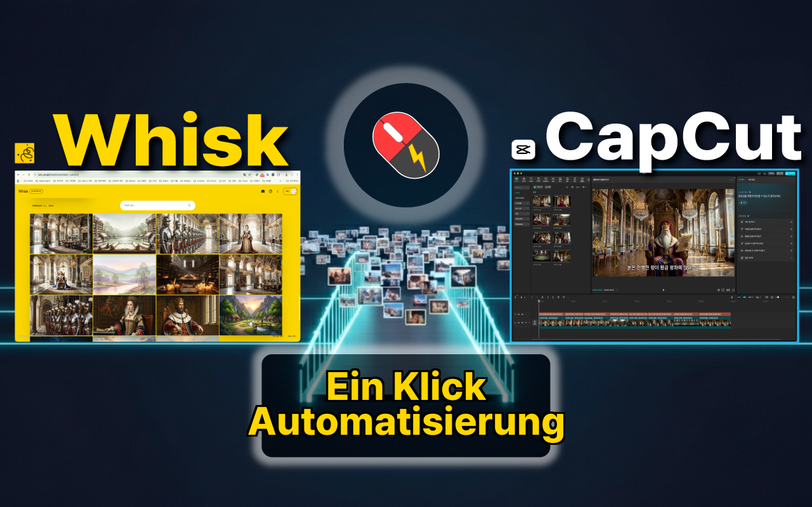
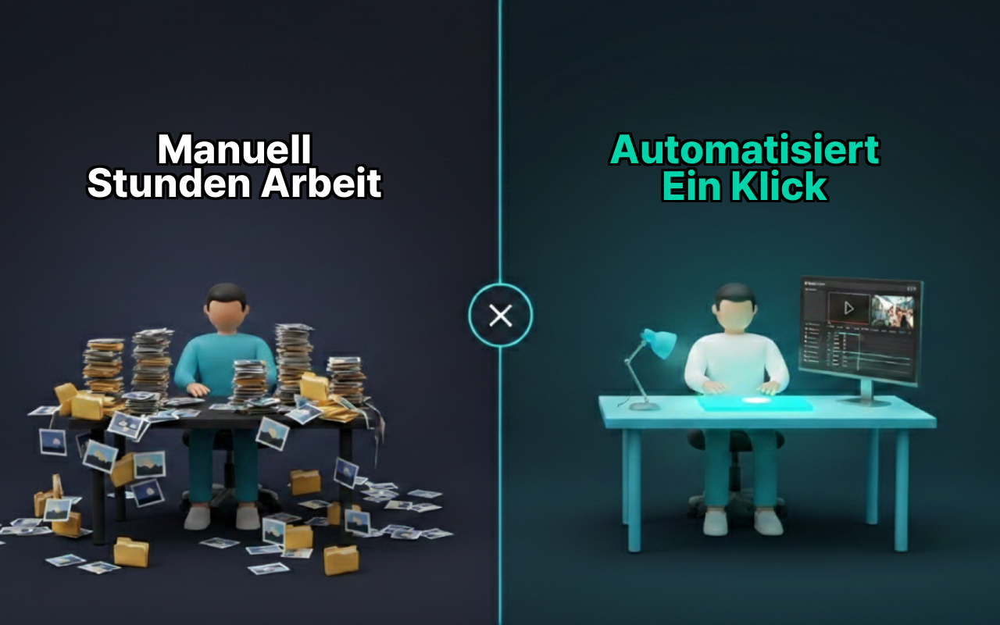
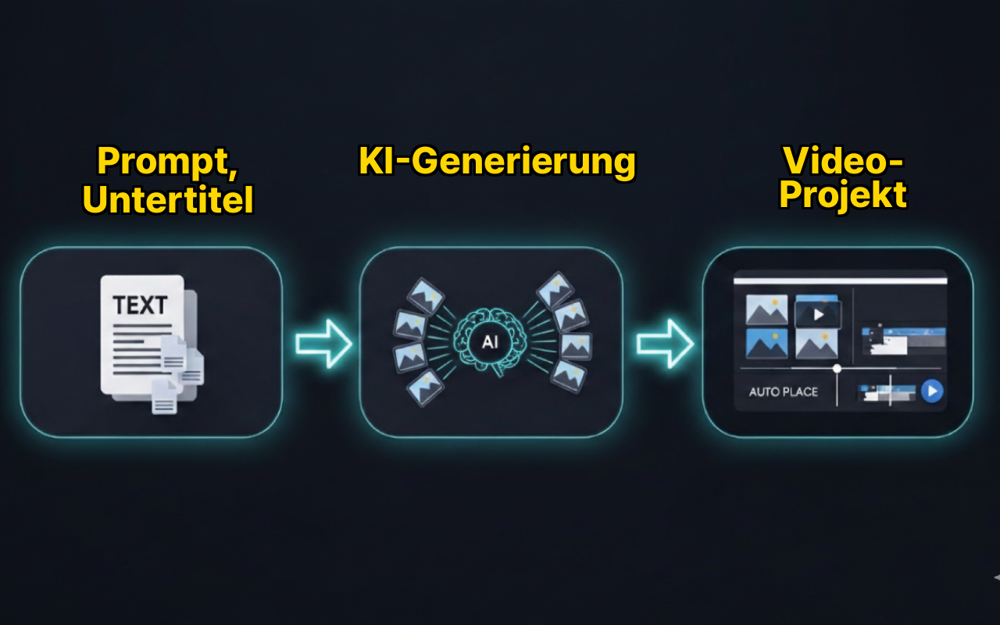
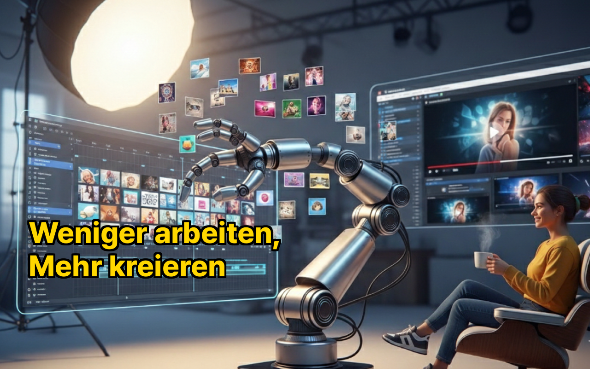

[🇺🇸 English](README.md) | [🇰🇷 한국어](README.ko.md) | [🇯🇵 日本語](README.ja.md) | 🇩🇪 **Deutsch**

# Whisk2CapCut Desktop

KI-Bilder massenhaft mit Google Whisk generieren und automatisch in CapCut-Videoprojekte exportieren — alles in einer Desktop-App.

  

240 Bilder für ein YouTube-Video. Jedes einzeln herunterladen. Jedes in CapCut ziehen. Untertitel hinzufügen. Animationen einfügen. Nach meiner dritten Nachtschicht wurde mir klar — das sollte nicht von Menschen erledigt werden. Jetzt ist es von der Massengenerierung von Bildern bis zum fertigen CapCut-Projekt nur noch **ein Klick entfernt**.

## Vorher & Nachher

  

## So funktioniert's

  

1. **Prompts vorbereiten** — Textprompts eingeben, CSV-Szenendaten importieren oder SRT-Untertiteldateien laden.
2. **Bilder generieren** — Massenhafte KI-Bildgenerierung über Google Whisk mit konsistenten Charakter-, Hintergrund- und Stilreferenzen. Bilder werden automatisch lokal gespeichert.
3. **Nach CapCut exportieren** — Ein Klick erzeugt ein vollständiges CapCut-Projekt mit Bildern auf der Timeline, Untertiteln und Ken Burns-Animationen.

## Visuelle Konsistenz

  

Taggen Sie Ihre Referenzbilder und sie werden automatisch jeder Szene zugeordnet — gleicher Charakter, gleicher Hintergrund und gleicher Stil über 200+ Szenen hinweg.

## Hauptfunktionen

- **Massen-KI-Generierung** — Erstellen Sie 100+ Bilder in ~10 Minuten mit Referenzbildern für konsistenten Stil. Auto-Retry bei Fehlern hält Batch-Läufe stabil.
- **Visuelle Kontinuität + Auto-Tag-Matching** — Taggen Sie Ihre Referenzbilder und Charakter, Hintergrund sowie Stil werden automatisch jeder Szene zugeordnet.
- **Auto-Speichern** — Jedes generierte Bild wird automatisch im lokalen Speicher gesichert. Kein einzelnes Herunterladen mehr.
- **Ein-Klick-CapCut-Export** — Generiert ein vollständiges Projekt mit Timeline, Medien, Untertiteln und Ken Burns-Animationen.
- **In CapCut öffnen** — Nach dem Export können Sie Ihr Projekt direkt in CapCut öffnen und sofort mit der Bearbeitung beginnen.
- **CapCut-Pfad automatisch erkennen** — Findet Ihren CapCut-Projektordner automatisch.
- **Ken Burns-Effekt** — Automatische Zoom-/Schwenk-Animationen auf Bildclips (Pro).
- **Auto-Untertitel** — Untertitel automatisch aus Prompts generieren oder aus CSV/SRT-Dateien importieren.
- **Mehrere Eingabeformate** — Textprompts, CSV mit Szenen-/Charakter-/Stildaten und SRT-Untertiteldateien.
- **Integrierter Web-View** — Direkter Zugriff auf Google Whisk innerhalb der App. Keine Chrome-Erweiterung erforderlich.
- **Deutsch / Englisch / Koreanisch** — Vollständige Lokalisierungsunterstützung.

  

## Für wen ist das?

- **KI-Video-Creator** — Schon ab 50 Bildern wird es mühsam. Exportieren Sie alles mit einem Klick in ein vollständiges CapCut-Projekt.
- **Gesichtslose YouTube- & KI-Story-Kanäle** — Automatisieren Sie den Bild-zu-Timeline-Workflow für KI-Slideshow- und Narrations-Videos.
- **Visuelle Geschichtenerzähler** — Halten Sie denselben Charakter, Hintergrund und Stil über Ihre gesamte Geschichte konsistent.
- **Shorts- & TikTok-Creator** — Verwandeln Sie KI-generierte Szenen schnell in Kurzform-Videoprojekte.
- **Pädagogen & Kursersteller** — Verwandeln Sie Skripte oder Untertitel in illustrierte Videolektionen.

## Chrome-Erweiterung vs Desktop

| | Chrome-Erweiterung | Desktop |
|---|---|---|
| CapCut-Export | ZIP-Download → manuelles Entpacken | Direktes Schreiben in den Projektordner |
| CapCut öffnen | Manuell | Auto-Start |
| Dateizugriff | File System Access API (eingeschränkt) | Node.js fs (voller Zugriff) |
| Whisk-Zugriff | Content Script im Chrome-Tab | Eingebauter WebContentsView |
| Layout | Einzelner Tab | Tab / Links-Rechts / Oben-Unten Split-Views |
| Chrome erforderlich | Ja | Nein |

## Downloads

- **macOS (Apple Silicon)**: [Whisk2CapCut-1.0.0-arm64.dmg](https://github.com/touchizen/whisk2capcut-desktop/releases/tag/v1.0.0)
- **Windows**: [Whisk2CapCut.Setup.1.0.0.exe](https://github.com/touchizen/whisk2capcut-desktop/releases/tag/v1.0.0)
- **Chrome-Erweiterung**: [Whisk2CapCut im Chrome Web Store](https://github.com/touchizen/whisk2capcut)

## Preise

Diese App bietet sowohl kostenlose als auch kostenpflichtige Funktionen.

**Kostenlos (kein Konto erforderlich):**
- Massen-Bildgenerierung mit Google Whisk — unbegrenzt
- Auto-Speichern generierter Bilder im lokalen Speicher — unbegrenzt
- CapCut-Export — 5 Exporte innerhalb von 7 Tagen

**Pro-Abonnement:**
- Unbegrenzte CapCut-Exporte
- Ken Burns-Effekt
- Prioritäts-Support
- $4,99/Monat oder $39,99/Jahr (33% Ersparnis)

Abonnements werden über [Lemon Squeezy](https://lemonsqueezy.com) verarbeitet. Diese App verarbeitet, speichert oder überträgt keine Zahlungsdaten. 7-Tage-Rückerstattungsrichtlinie beim ersten Abonnement.

## Voraussetzungen

- Zugang zu [Google Whisk](https://labs.google/fx/tools/whisk) (Google Labs)
- [CapCut](https://www.capcut.com/) Desktop-App (kostenlose Version funktioniert)
- Internetverbindung für KI-Bildgenerierung

## Datenschutz & Sicherheit

Diese App läuft vollständig auf Ihrem lokalen Rechner. Die gesamte Bildgenerierung wird von Google Labs Whisk verarbeitet — wir verarbeiten, speichern oder übertragen Ihre Bilder niemals über unsere Server. Weitere Details finden Sie in unserer [Datenschutzerklärung](https://touchizen.com/en/privacy).

## Support

Fragen oder Feedback? Kontaktieren Sie uns unter gordon.ahn@touchizen.com

## Links

- **Website**: [touchizen.com](https://touchizen.com)
- **YouTube**: [@touchizen](https://youtube.com/@touchizen)
- **Discord**: [touchizen](https://discord.gg/touchizen)

---

*Erstellt von [Touchizen](https://touchizen.com)*

*Haftungsausschluss: Diese App ist ein unabhängiges Produkt von Touchizen und steht in keiner Verbindung zu Google oder ByteDance (CapCut) und wird von diesen weder unterstützt noch gesponsert.*
