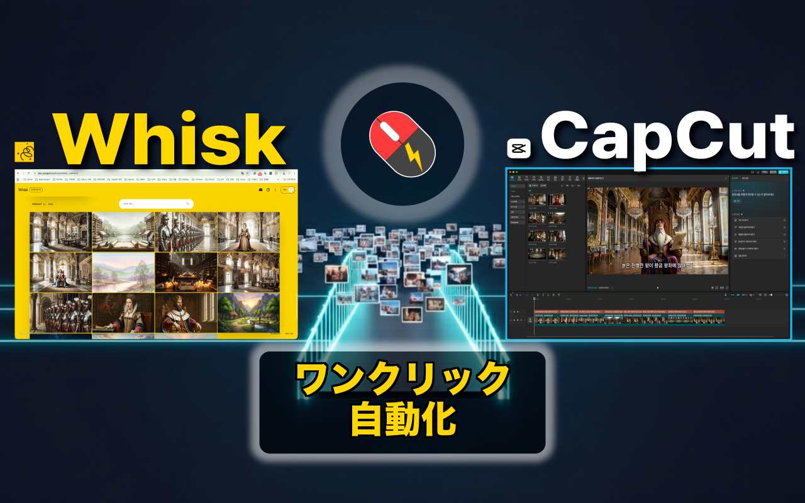
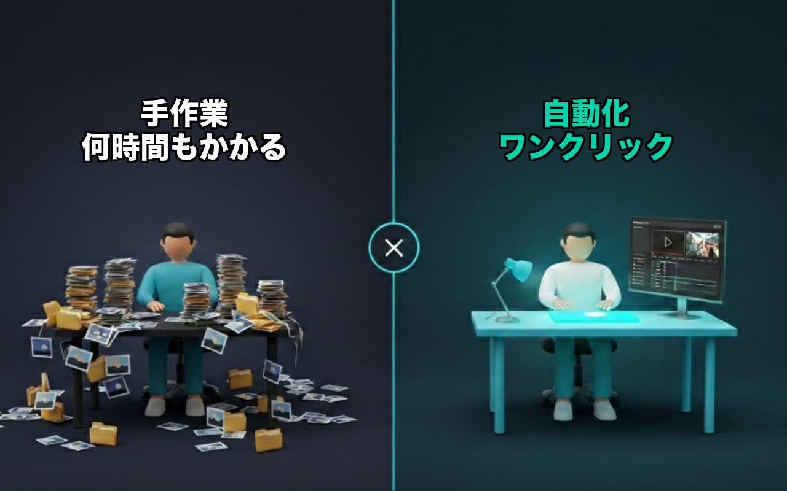
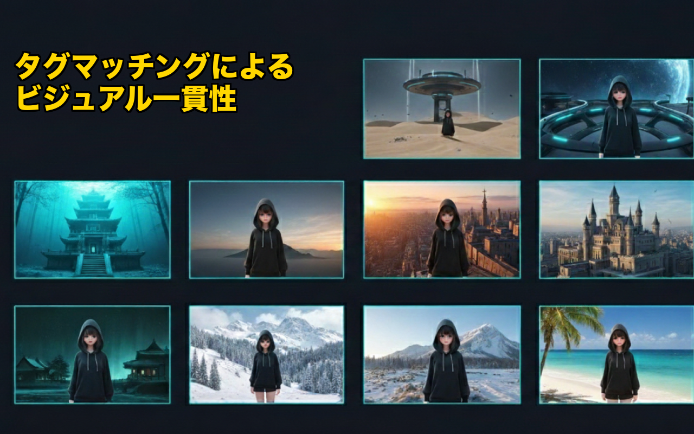
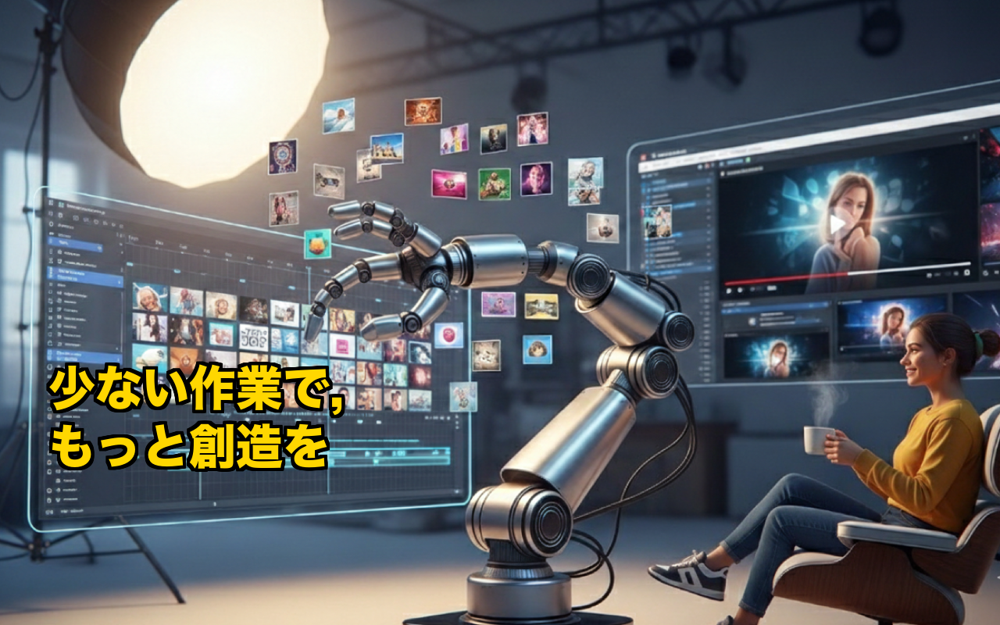

[🇺🇸 English](README.md) | [🇰🇷 한국어](README.ko.md) | 🇯🇵 **日本語** | [🇩🇪 Deutsch](README.de.md)

# Whisk2CapCut Desktop

Google WhiskでAI画像を一括生成し、CapCut動画プロジェクトへ自動変換するデスクトップアプリ

  

YouTube動画1本に画像240枚。1枚ずつダウンロードし、1枚ずつCapCutにドラッグし、字幕を付け、アニメーションを追加する... 3回目の徹夜で気づきました — これは人間ではなく自動化がやるべき仕事だと。今では画像の一括生成からCapCutプロジェクト完成まで、**ワンクリック**で完了します。

## Before & After

  

## 使い方

  

1. **プロンプト準備** — テキストプロンプト入力、CSVシーンデータのインポート、またはSRT字幕ファイルの読み込み
2. **画像生成** — Google Whiskでキャラクター、背景、スタイルのリファレンスを維持しながら一括生成。生成された画像は自動保存されます。
3. **CapCutエクスポート** — ワンクリックでタイムライン、字幕、Ken Burnsアニメーションを含む完全なCapCutプロジェクトを生成

## ビジュアル一貫性

  

リファレンス画像にタグを付けると、各シーンに合ったキャラクター、背景、スタイルが自動的にマッチングされ、200以上のシーンでも一貫したビジュアルを維持します。

## 主な機能

- **一括AI生成** — リファレンス画像で一貫したスタイルを維持しながら、100枚以上の画像を約10分で生成。エラー自動リトライで大量生成の安定性を確保。
- **ビジュアル連続性 + 自動タグマッチング** — リファレンス画像にタグを付けると、各シーンに合ったキャラクター、背景、スタイルが自動マッチング。
- **自動保存** — 生成された画像がローカルストレージに自動保存。1枚ずつダウンロードする必要はありません。
- **ワンクリックCapCutエクスポート** — タイムライン、メディア、字幕、Ken Burnsアニメーションを含む完成プロジェクトを即座に生成。
- **CapCutですぐに開く** — エクスポート後、CapCutでプロジェクトをすぐに開いて編集を開始できます。
- **CapCutパス自動検出** — CapCutプロジェクトフォルダを自動的に検出します。
- **Ken Burns効果** — 画像クリップに自動ズーム/パンアニメーション適用 (Pro)
- **自動字幕** — プロンプトから字幕を自動生成、またはCSV/SRTファイルからインポート可能。
- **多様な入力形式** — テキストプロンプト、CSV（シーン/キャラクター/スタイルデータ）、SRT字幕ファイル
- **統合Webビュー** — アプリ内から直接Google Whiskにアクセス。Chrome拡張機能不要。
- **日本語 / 英語 / 韓国語** — 完全な多言語対応

  

## こんな方におすすめ

- **AI動画クリエイター** — 50枚を超えると退屈な繰り返し作業。ワンクリックでCapCut動画プロジェクトに変換。
- **顔出しなしYouTube & AIストーリーチャンネル** — AIスライドショー/ナレーション動画の画像→タイムライン繰り返し作業を自動化。
- **ビジュアルストーリーテラー** — リファレンスベースの生成で、ストーリー全体を通じて同じキャラクター、背景、スタイルを維持。
- **ショート動画 & TikTokクリエイター** — AI生成シーンを素早くショート動画プロジェクトに変換。
- **教育コンテンツ制作者** — スクリプトや字幕からイラスト動画レッスンを制作。

## Chrome拡張 vs デスクトップアプリ

| | Chrome拡張 | デスクトップアプリ |
|---|---|---|
| CapCutエクスポート | ZIPダウンロード → 手動解凍 | プロジェクトフォルダに直接書き込み |
| CapCutを開く | 手動 | 自動起動 |
| ファイルアクセス | File System Access API（制限あり） | Node.js fs（フルアクセス） |
| Whiskアクセス | Chromeタブのコンテンツスクリプト | 内蔵WebContentsView |
| レイアウト | 単一タブ | タブ / 左右 / 上下分割ビュー |
| Chrome必要 | 必須 | 不要 |

## ダウンロード

- **macOS (Apple Silicon)**: [Whisk2CapCut-1.0.0-arm64.dmg](https://github.com/touchizen/whisk2capcut-desktop/releases/tag/v1.0.0)
- **Windows**: [Whisk2CapCut.Setup.1.0.0.exe](https://github.com/touchizen/whisk2capcut-desktop/releases/tag/v1.0.0)
- **Chrome拡張**: [Whisk2CapCut on Chrome Web Store](https://github.com/touchizen/whisk2capcut)

## 料金

このアプリは無料機能と有料機能の両方を提供しています。

**無料（アカウント不要）:**
- Google Whiskでの一括画像生成 — 無制限
- 生成画像のローカル自動保存 — 無制限
- CapCutエクスポート — 7日間で5回まで

**Proサブスクリプション:**
- 無制限CapCutエクスポート
- Ken Burns効果
- 優先サポート
- 月額$4.99 または 年額$39.99（33%割引）

サブスクリプションの決済は[Lemon Squeezy](https://lemonsqueezy.com)を通じて安全に処理されます。本アプリは決済情報を収集・保存しません。初回サブスクリプション後7日以内の返金に対応。

## 必要条件

- [Google Whisk](https://labs.google/fx/tools/whisk)へのアクセス（Google Labs）
- [CapCut](https://www.capcut.com/) デスクトップアプリ（無料版で利用可能）
- AI画像生成のためのインターネット接続

## プライバシーと安全性

本アプリは完全にお使いのローカルPCで動作します。すべての画像生成はGoogle Labs Whiskで処理され、当社のサーバーを通じて画像を処理、保存、送信することはありません。詳細は[プライバシーポリシー](https://touchizen.com/en/privacy)をご覧ください。

## サポート

ご質問やフィードバックは gordon.ahn@touchizen.com までお問い合わせください。

## リンク

- **ウェブサイト**: [touchizen.com](https://touchizen.com)
- **YouTube**: [@touchizen](https://youtube.com/@touchizen)
- **Discord**: [touchizen](https://discord.gg/DTMMs8TZDN)

---

*[Touchizen](https://touchizen.com) 制作*

*免責事項: 本アプリはTouchizenが開発した独立した製品であり、GoogleまたはByteDance（CapCut）と提携、推奨、スポンサー関係はありません。*
