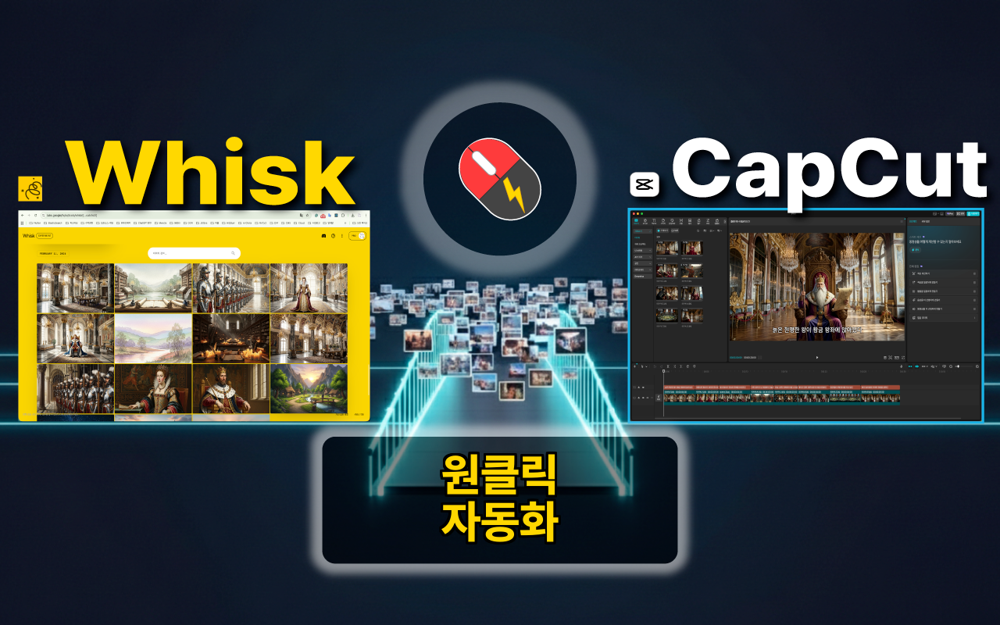
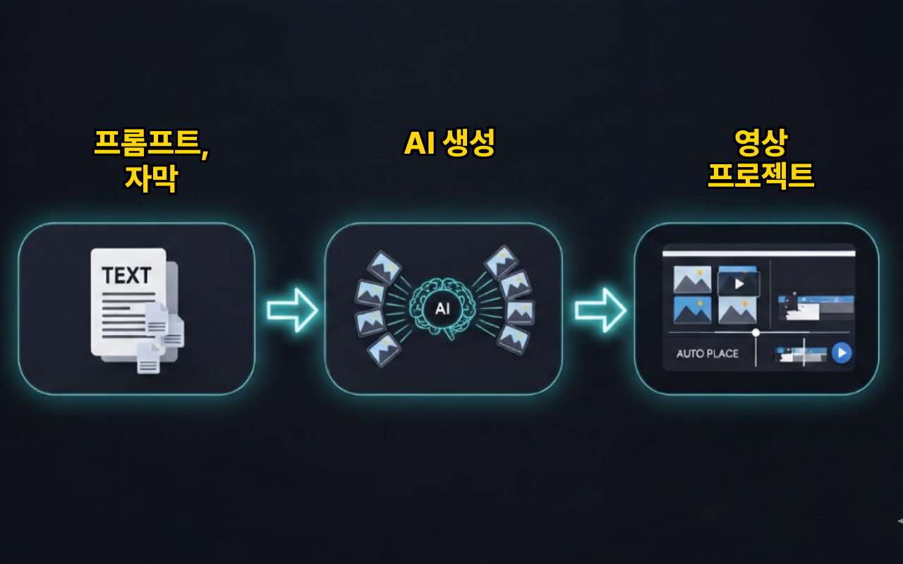
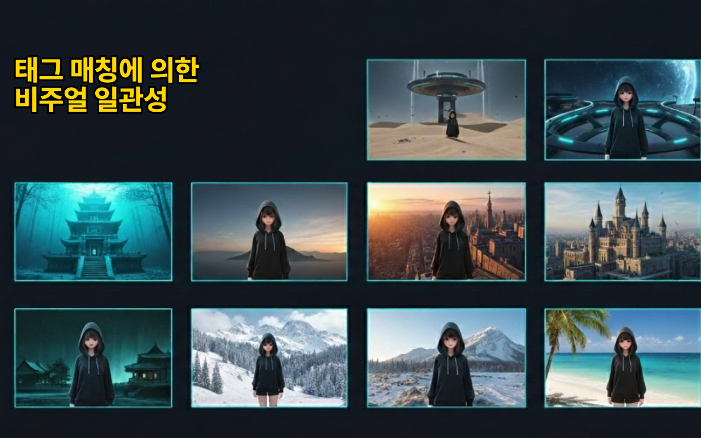
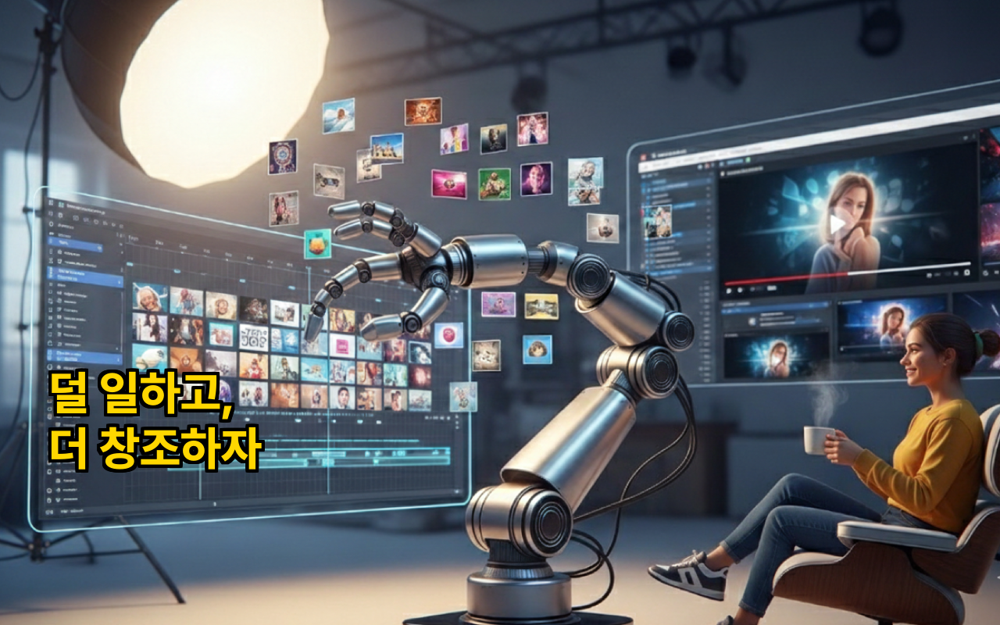

[🇺🇸 English](README.md) | 🇰🇷 **한국어** | [🇯🇵 日本語](README.ja.md) | [🇩🇪 Deutsch](README.de.md)

# Whisk2CapCut Desktop

Google Whisk으로 AI 이미지를 대량 생성하고, CapCut 영상 프로젝트로 자동 변환하는 데스크톱 앱

  

유튜브 영상 하나에 이미지 240장. 하나씩 다운로드하고, 하나씩 CapCut에 끌어다 놓고, 자막 달고, 애니메이션 넣고... 세 번째 밤샘 끝에 깨달았습니다 — 이건 사람이 아니라 자동화가 해야 할 일이라는 걸. 이제 이미지 대량 생성부터 CapCut 프로젝트 완성까지, **버튼 하나로** 끝납니다.

## Before & After

  

## 사용 방법

  

1. **프롬프트 준비** — 텍스트 프롬프트 입력, CSV 씬 데이터 가져오기, 또는 SRT 자막 파일 로드
2. **이미지 생성** — Google Whisk에서 캐릭터, 배경, 스타일 레퍼런스를 유지하며 대량 생성. 생성된 이미지는 자동 저장됩니다.
3. **CapCut 내보내기** — 원클릭으로 타임라인, 자막, Ken Burns 애니메이션이 포함된 완전한 CapCut 프로젝트 생성

## 비주얼 일관성

  

레퍼런스 이미지에 태그를 붙이면 각 씬에 맞는 캐릭터, 배경, 스타일이 자동으로 매칭되어 200개 이상의 장면에서도 일관된 비주얼을 유지합니다.

## 주요 기능

- **일괄 AI 생성** — 레퍼런스 이미지로 일관된 스타일을 유지하며 100장 이상의 이미지를 약 10분에 생성. 에러 자동 재시도로 대량 생성 안정성 확보.
- **시각적 연속성 + 자동 태그 매칭** — 레퍼런스 이미지에 태그를 붙이면 각 씬에 맞는 캐릭터, 배경, 스타일이 자동으로 매칭됩니다.
- **자동 저장** — 생성된 이미지가 로컬 저장소에 자동 저장됩니다. 하나씩 다운로드할 필요 없습니다.
- **원클릭 CapCut 내보내기** — 타임라인, 미디어, 자막, Ken Burns 애니메이션이 포함된 완성된 프로젝트를 바로 생성.
- **CapCut에서 바로 열기** — 내보내기 후 CapCut에서 프로젝트를 바로 열어 편집을 시작할 수 있습니다.
- **CapCut 경로 자동 감지** — CapCut 프로젝트 폴더를 자동으로 찾아줍니다.
- **Ken Burns 효과** — 이미지 클립에 자동 줌/팬 애니메이션 적용 (Pro)
- **자동 자막** — 프롬프트에서 자막을 자동 생성하거나 CSV/SRT 파일에서 가져오기 가능.
- **다양한 입력 형식** — 텍스트 프롬프트, CSV(씬/캐릭터/스타일 데이터), SRT 자막 파일
- **통합 웹 뷰** — 앱 안에서 바로 Google Whisk에 접근. Chrome 확장 프로그램 불필요.
- **한국어 / 영어** — 완전한 다국어 지원

  

## 이런 분께 추천합니다

- **AI 영상 크리에이터** — 50장만 넘어도 지루한 반복 작업, 원클릭으로 CapCut 영상 프로젝트로 변환.
- **얼굴 없는 YouTube & AI 스토리 채널** — AI 슬라이드쇼/나레이션 영상의 이미지→타임라인 반복 작업 자동화.
- **비주얼 스토리텔러** — 레퍼런스 기반 생성으로 전체 이야기에 걸쳐 동일한 캐릭터, 배경, 스타일 유지.
- **숏폼 & TikTok 크리에이터** — AI 생성 장면을 빠르게 숏폼 영상 프로젝트로 변환.
- **교육 콘텐츠 제작자** — 스크립트나 자막에서 일러스트 영상 강의를 제작.

## Chrome 확장 vs 데스크톱 앱

| | Chrome 확장 | 데스크톱 앱 |
|---|---|---|
| CapCut 내보내기 | ZIP 다운로드 → 수동 압축 해제 | 프로젝트 폴더에 직접 쓰기 |
| CapCut 열기 | 수동 | 자동 실행 |
| 파일 접근 | File System Access API (제한적) | Node.js fs (전체 접근) |
| Whisk 접근 | Chrome 탭에서 콘텐츠 스크립트 | 내장 WebContentsView |
| 레이아웃 | 단일 탭 | 탭 / 좌우 / 상하 분할 뷰 |
| Chrome 필요 | 필수 | 불필요 |

## 다운로드

- **macOS (Apple Silicon)**: [Whisk2CapCut-1.0.0-arm64.dmg](https://github.com/touchizen/whisk2capcut-desktop/releases/tag/v1.0.0)
- **Windows**: [Whisk2CapCut.Setup.1.0.0.exe](https://github.com/touchizen/whisk2capcut-desktop/releases/tag/v1.0.0)
- **Chrome 확장**: [Whisk2CapCut on Chrome Web Store](https://github.com/touchizen/whisk2capcut)

## 가격

이 앱은 무료 기능과 유료 기능을 모두 제공합니다.

**무료 (계정 불필요):**
- Whisk 대량 이미지 생성 — 무제한
- 생성 이미지 로컬 자동 저장 — 무제한
- CapCut 내보내기 — 최근 7일 기준 5회

**Pro 구독:**
- 무제한 CapCut 내보내기
- Ken Burns 효과
- 우선 지원
- 월 $4.99 또는 연 $39.99 (33% 절약)

구독 결제는 [Lemon Squeezy](https://lemonsqueezy.com)를 통해 안전하게 처리됩니다. 본 앱은 결제 정보를 수집하거나 저장하지 않습니다. 첫 구독 후 7일 이내 환불 가능.

## 필요 사항

- [Google Whisk](https://labs.google/fx/tools/whisk) 접근 (Google Labs)
- [CapCut](https://www.capcut.com/) 데스크톱 앱 (무료 버전 가능)
- AI 이미지 생성을 위한 인터넷 연결

## 개인정보 및 안전

본 앱은 전적으로 사용자의 로컬 PC에서 작동합니다. 모든 이미지 생성은 Google Labs Whisk에서 처리되며, 당사 서버를 통해 이미지를 처리, 저장 또는 전송하지 않습니다. 자세한 내용은 [개인정보처리방침](https://touchizen.com/ko/privacy)을 참조하세요.

## 지원

질문이나 피드백은 gordon.ahn@touchizen.com으로 문의해주세요.

## 링크

- **웹사이트**: [touchizen.com](https://touchizen.com)
- **YouTube**: [@touchizen](https://youtube.com/@touchizen)
- **Discord**: [touchizen](https://discord.gg/DTMMs8TZDN)

---

*[Touchizen](https://touchizen.com) 제작*

*면책 조항: 이 앱은 Touchizen에서 개발한 독립적인 제품이며, Google 또는 ByteDance(CapCut)와 제휴, 보증 또는 후원 관계가 없습니다.*
