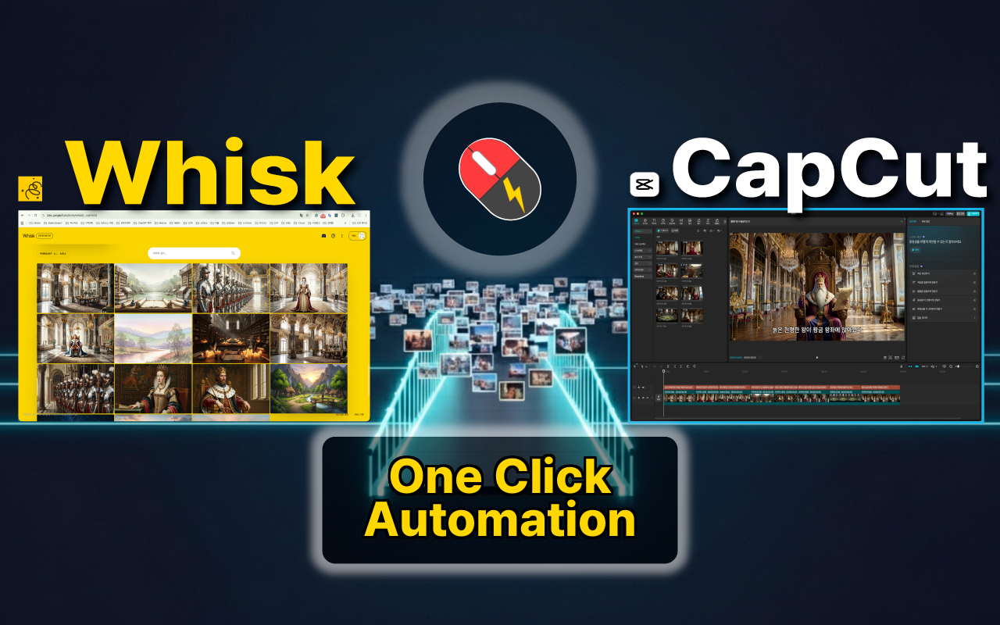
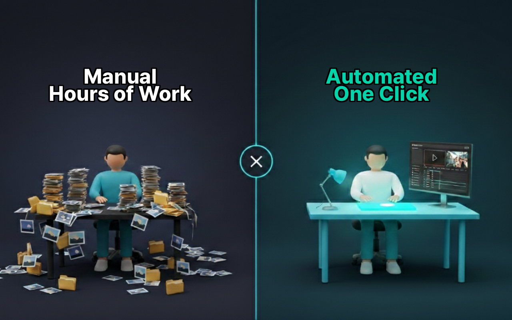
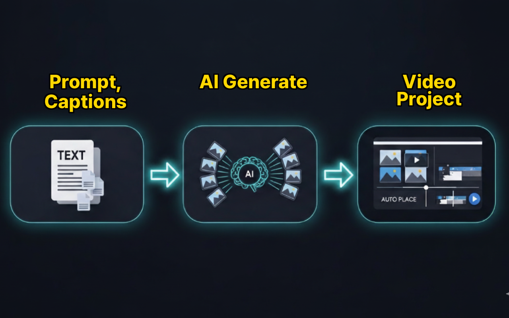
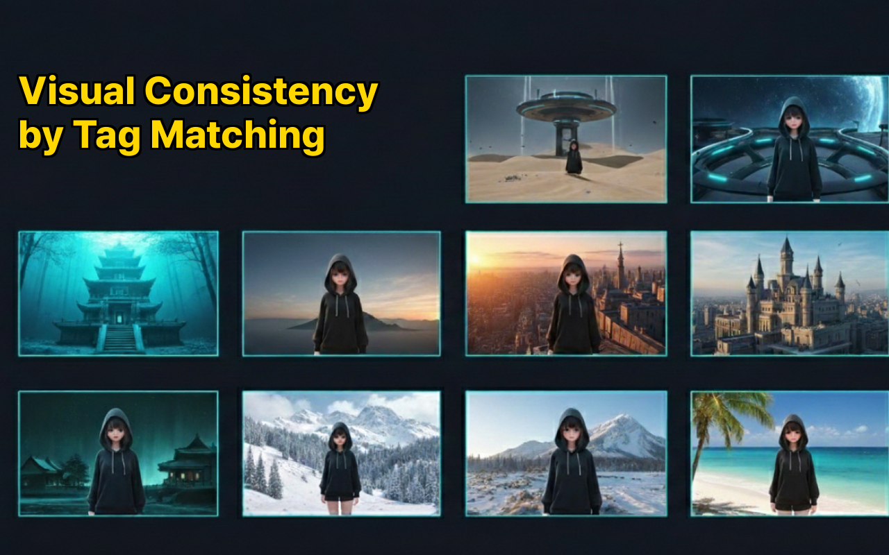
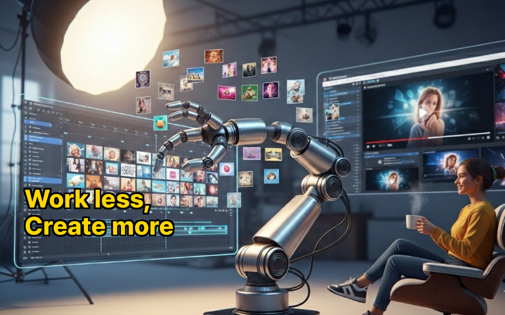

**English** | [한국어](README.ko.md)

# Whisk2CapCut Desktop

Bulk generate AI images with Google Whisk and auto-export to CapCut video projects — all in one desktop app.

  

240 images for one YouTube video. Downloading them one by one. Dragging each into CapCut. Adding subtitles. Adding animations. After my third all-nighter, it hit me — this isn't something humans should be doing. Now, from bulk image generation to a finished CapCut project, it's just **one click away**.

## Before & After

  

## How It Works

  

1. **Prepare prompts** — Type text prompts, import CSV scene data, or load SRT subtitles.
2. **Generate images** — Bulk-create AI images through Google Whisk with consistent character, background, and style references. Images are auto-saved to your local storage.
3. **Export to CapCut** — One click to produce a complete CapCut project with images on the timeline, subtitles, and Ken Burns animations.

## Visual Consistency

  

Tag your reference images and they're automatically matched to each scene — keeping the same character, background, and style across 200+ scenes.

## Key Features

- **Bulk AI Generation** — Create 100+ images in ~10 minutes using reference images for consistent style. Auto-retry on errors keeps batch runs stable.
- **Visual Continuity with Auto Tag Matching** — Tag your reference images and they're automatically matched to each scene.
- **Auto-Save** — Every generated image is saved to your local storage automatically. No more downloading one by one.
- **One-Click CapCut Export** — Generates a complete project with timeline, media, subtitles, and Ken Burns animations.
- **Open in CapCut** — After export, open your project directly in CapCut and start editing right away.
- **Auto-Detect CapCut Path** — Finds your CapCut project folder automatically.
- **Ken Burns Effect** — Auto zoom/pan animations on image clips to bring static images to life (Pro).
- **Auto Subtitle** — Generate subtitles from prompts automatically, or import from CSV/SRT files.
- **Multiple Input Formats** — Text prompts, CSV with scene/character/style data, and SRT subtitle files.
- **Integrated Web View** — Access Google Whisk directly inside the app. No Chrome extension required.
- **Korean / English** — Full localization support.

  

## Who Is This For?

- **AI Video Creators** — Even 50 images gets tedious. Export them all to a complete CapCut project with one click.
- **Faceless YouTube & AI Story Channels** — Automate the image-to-timeline workflow for AI slideshow and narration videos.
- **Visual Storytellers** — Keep the same character, background, and style consistent across your entire story.
- **Shorts & TikTok Creators** — Quickly turn AI-generated scenes into short-form video projects.
- **Educators & Course Creators** — Turn scripts or subtitles into illustrated video lessons.

## Chrome Extension vs Desktop

| | Chrome Extension | Desktop |
|---|---|---|
| CapCut Export | ZIP download → manual extract | Direct write to project folder |
| Open CapCut | Manual | Auto-launch |
| File Access | File System Access API (limited) | Node.js fs (full access) |
| Whisk Access | Content script in Chrome tab | Built-in WebContentsView |
| Layout | Single tab | Tab / Left-Right / Top-Bottom split views |
| Chrome Required | Yes | No |

## Downloads

- **macOS (Apple Silicon)**: [Whisk2CapCut-1.0.0-arm64.dmg](https://github.com/touchizen/whisk2capcut-desktop/releases/tag/v1.0.0)
- **Windows**: [Whisk2CapCut.Setup.1.0.0.exe](https://github.com/touchizen/whisk2capcut-desktop/releases/tag/v1.0.0)
- **Chrome Extension**: [Whisk2CapCut on Chrome Web Store](https://github.com/touchizen/whisk2capcut)

## Pricing

This app offers both free and paid features.

**Free (no account required):**
- Bulk image generation with Google Whisk — unlimited
- Auto-save generated images to local storage — unlimited
- CapCut export — 5 exports within any 7-day window

**Pro Subscription:**
- Unlimited CapCut exports
- Ken Burns effect
- Priority support
- $4.99/month or $39.99/year (save 33%)

Subscriptions are processed via [Lemon Squeezy](https://lemonsqueezy.com). No payment data is handled or stored by this application. 7-day refund policy on first subscription.

## Requirements

- Access to [Google Whisk](https://labs.google/fx/tools/whisk) (Google Labs)
- [CapCut](https://www.capcut.com/) desktop app (free version works)
- Internet connection for AI image generation

## Privacy & Safety

This app operates entirely on your local machine. All image generation is handled by Google Labs Whisk — we never process, store, or transmit your images through our servers. For details, see our [Privacy Policy](https://touchizen.com/en/privacy).

## Support

Questions or feedback? Contact us at gordon.ahn@touchizen.com

## Links

- **Website**: [touchizen.com](https://touchizen.com)
- **YouTube**: [@touchizen](https://youtube.com/@touchizen)
- **Discord**: [touchizen](https://discord.gg/touchizen)

---

*Made by [Touchizen](https://touchizen.com)*

*Disclaimer: This app is an independent product developed by Touchizen and is not affiliated with, endorsed by, or sponsored by Google or ByteDance (CapCut).*
